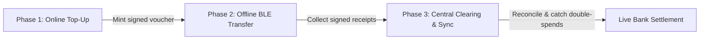

# Transact — Cryptographically Secure Offline UPI Payment Protocol

> **Digital payments that survive when the network fails.**
> An asynchronous, hardware-isolated offline payment protocol built for UPI Lite-aligned compliance, subterranean transit, rural commerce, and disaster resilience.

---

## Executive Summary

India processes billions of UPI transactions monthly, yet payments fail completely in underground metro lines, rural dead zones, high-density venues, and during cellular outages. Existing offline options — UPI Lite, USSD (`*99#`), and feature-phone SIM-overlay solutions — solve the "top up while online, spend while offline" problem, but none of them pair that with real-time, on-device fraud detection or a dedicated low-cost merchant terminal.

**Transact** is a zero-trust, three-phase asynchronous clearing protocol built on **Android Hardware Keystore (TEE/StrongBox) ECDSA signing**, **signed escrow vouchers**, and **monotonic anti-replay sequence counters** — designed to be a working reference implementation of what a UPI Lite-compliant offline payment system actually requires under the hood.

---

## System Architecture

Transact decouples fund locking from transaction clearing across three phases:



### Phase 1 — Online Voucher Minting (Escrow Lock)
- User authenticates with their bank account via 2FA while online.
- The clearinghouse locks the designated funds in escrow and mints a signed **voucher token** (ECDSA, NIST P-256).
- Stamped risk policy enforces a conservative internal cap, well inside RBI's current UPI Lite ceiling (see Regulatory Alignment below): **₹200/transaction, ₹1,000 cumulative offline balance, 7-day voucher expiry, 10-transaction count cap.**

### Phase 2 — Offline P2P Near-Field Transfer (Zero Connectivity)
- Sender enters the merchant ID and amount with no network present (subway, remote highway, flight mode).
- The device increments a local monotonic sequence counter (`#1, #2, #3…`).
- The hardware Keystore (TEE/StrongBox) signs a canonical payload:

  ```
  Payload = VoucherID ‖ SenderID ‖ ReceiverID ‖ Amount ‖ SeqNo ‖ Timestamp
  ```

- The payload is transmitted over Bluetooth Low Energy (BLE) or NFC.
- The receiving device (phone or merchant terminal) verifies both the clearinghouse's voucher signature and the sender's transaction signature **entirely locally, with zero connectivity**.

### Phase 3 — Central Asynchronous Reconciliation (Cloud Clearing)
- Once either party reconnects, queued transactions are pushed to the clearinghouse (`POST /api/sync`).
- The reconciliation engine validates every cryptographic proof and sequence number.
- Funds move from escrow to the merchant's live bank balance.
- Double-spends and sequence rollbacks are detected immediately, marked `CONFLICT` or `DUPLICATE`, and the offending wallet is locked pending review.

---

## Threat Model & Cryptographic Defenses

| Threat Vector | Attack Mechanism | Mitigation |
| :--- | :--- | :--- |
| **Double-spending** | Sender broadcasts the same signed sequence number to multiple merchants before either syncs. | Clearinghouse enforces a unique index on `(voucher_id, sequence_number)`. Only the first authentic submission settles; every later one is flagged `DUPLICATE`/`CONFLICT` and the voucher is blacklisted. |
| **Transaction replay** | Malicious merchant resubmits a valid receipt to get paid twice. | Unique per-transaction signatures plus sequence tracking mean repeat submissions are recognized and dropped without a second disbursement. |
| **State rollback** | Device is rooted, local DB is snapshotted, funds are spent, then the snapshot is restored to "reset" the balance. | Reconciliation compares each submitted sequence against `last_settled_seq`. Any `seq ≤ last_settled_seq` triggers an immediate `CONFLICT` alert. |
| **Key extraction** | Malware attempts to read the signing key out of app memory. | Private keys are generated and held exclusively inside Android Keystore (StrongBox/TEE); raw key material never enters application memory. |

---

## Regulatory Alignment (RBI Offline Payments Framework / UPI Lite)

As of RBI's most recent revision to the offline framework, **UPI Lite permits up to ₹1,000 per transaction with a ₹5,000 cumulative wallet cap.** Transact's own internal policy is deliberately more conservative than the regulatory ceiling — a design choice, not a workaround:

- **Per-transaction cap:** ₹200 (well under RBI's ₹1,000 ceiling)
- **Cumulative offline balance:** ₹1,000 (well under RBI's ₹5,000 cap)
- **Online AFA top-up:** vouchers can only be minted while authenticated online, matching RBI's requirement that offline *credit* to a wallet is never possible
- **Auditability:** non-repudiable cryptographic receipts provide a full dispute-resolution trail

*(Note: the RBI limits above were revised upward in late 2024 from the original ₹500/₹2,000 offline framework — this README reflects the current figures. Recheck the RBI circular before citing these numbers externally, since they've moved once already.)*

---

## Positioning Relative to Existing Work

Transact is not the first attempt at offline UPI — being upfront about that is part of the credibility case, not a weakness:

- **UPI Lite** is the production precedent this project is deliberately aligned with, not competing against.
- **Eroute Technologies** piloted a SIM-overlay offline UPI solution for feature phones under RBI's regulatory sandbox.
- Prior academic and open-source work has explored BLE/blockchain-based offline payment demos with similar sequence-number and double-spend reasoning.

What Transact adds on top of that prior art: a working, demoable reference implementation with hardware-backed key isolation end to end, plus a roadmap toward on-device fraud scoring and a dedicated hardware merchant terminal (see Roadmap).

---

## Razorpay Offline SDK — Integration Concept

This is a **conceptual sketch** of how Transact's offline layer could plug into a Razorpay merchant integration as a fallback module — not an existing or announced Razorpay product:

```dart
// Conceptual: Razorpay drop-in offline fallback
final razorpayOffline = RazorpayOfflineClient(
  merchantId: "rzp_merchant_terminal_01",
  riskPolicy: UPILitePolicy(maxTx: 200.0),
);

// Listen for offline BLE payments when connectivity drops
razorpayOffline.startOfflineListener(
  onPaymentReceived: (receipt) {
    print("Offline payment verified locally: ₹${receipt.amount}");
  },
);
```

---

## Roadmap (Not Yet Implemented)

- **On-device risk scoring** — a lightweight TFLite/ONNX model scoring transactions for anomalies (velocity, sequence-jump size, impossible-travel pattern) *before* the BLE handshake completes, rather than only at post-hoc reconciliation.
- **Graph-based collusion detection** — at reconciliation time, analyze the transaction graph across a sync batch to catch coordinated multi-receiver double-spend rings, not just single bad sequence numbers.
- **ESP32 hardware merchant terminal** — a low-cost, receive-only BLE terminal with on-chip ECDSA verification (mbedTLS), local OLED confirmation display, and physical accept-button confirmation, for merchants who don't want to run a full app.

---

## Quickstart & Demo Guide

### Prerequisites
- Python 3.10+
- Flutter 3.x+ (Dart SDK 3.0+)

### 1. Start the backend clearinghouse
```bash
cd backend
python -m venv venv
.\venv\Scripts\activate   # Windows
pip install -r requirements.txt
uvicorn app.main:app --reload --host 0.0.0.0 --port 8000
```
API docs live at `http://127.0.0.1:8000/docs`.

### 2. Run the Flutter app
```bash
cd mobile
flutter pub get
flutter run -d chrome     # or windows / android
```

### 3. Demo walkthrough
1. **Landing screen** — review the architecture pillars, tap **Launch Interactive Demo**.
2. **Top up offline funds** — while `ONLINE`, top up ₹1,000 from the simulated bank to mint a signed voucher.
3. **Switch to OFFLINE** — tap the network banner to simulate `ZERO CONNECTIVITY`.
4. **Pay offline** — send `merchant@transact` ₹100. Watch the hardware Keystore sign the payload and the sequence counter increment (`#1`).
5. **Merchant verification** — open Merchant Mode, see the incoming packet, tap **Verify & Accept** to validate the signature locally.
6. **Reconcile** — switch back to `ONLINE`, open Reconciliation & Audit, tap **Reconcile**, watch the settlement badges turn green.
7. **Fraud suite** — open the Double-Spend & Fraud Engine, pick an attack (replay / sequence rollback / limit breach), run it, and watch the clearinghouse catch and isolate it live.

---

## Project Structure

```
transact/
├── backend/
│   ├── app/
│   │   ├── main.py              # FastAPI endpoints & routing
│   │   ├── models.py            # SQLAlchemy database models
│   │   ├── schemas.py           # Pydantic request/response schemas
│   │   ├── crypto.py            # ECDSA secp256r1 signing & verification
│   │   ├── database.py          # SQLite connection
│   │   └── reconciliation.py    # Anti-replay & double-spend clearing engine
│   ├── tests/
│   │   └── test_reconciliation.py
│   └── requirements.txt
├── mobile/
│   ├── lib/
│   │   ├── db/secure_storage.dart          # Encrypted local storage & queues
│   │   ├── network/api_client.dart         # API + network simulator integration
│   │   ├── security/keystore_manager.dart  # Android Keystore (TEE) integration + fallback
│   │   ├── services/
│   │   │   ├── network_simulator.dart      # Online/offline demo toggle
│   │   │   └── offline_transport.dart      # BLE near-field simulation bus
│   │   ├── screens/
│   │   │   ├── landing_screen.dart
│   │   │   ├── dashboard_screen.dart
│   │   │   ├── top_up_screen.dart
│   │   │   ├── offline_pay_screen.dart
│   │   │   ├── merchant_mode_screen.dart
│   │   │   ├── reconciliation_screen.dart
│   │   │   ├── demo_fraud_screen.dart
│   │   │   ├── security_screen.dart
│   │   │   └── architecture_screen.dart
│   │   ├── widgets/network_banner.dart
│   │   └── main.dart
│   └── pubspec.yaml
└── README.md
```
