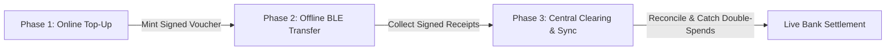

# Transact: Cryptographically Secure Offline UPI Payment Protocol

> **"Digital payments that survive when the network fails."**  
> An asynchronous, hardware-isolated offline payment infrastructure built for UPI Lite compliance, subterranean transit, rural commerce, and disaster resilience.

---

## 📌 Executive Summary

India processes over **14 billion UPI transactions monthly**, yet transactions fail completely in underground metro lines, rural dead-zones, high-density sporting arenas, and during cellular outages. Existing solutions like basic UPI Lite still struggle with merchant reconciliation delays, replay attacks, and trust verification without an active data connection.

**Transact** solves this by establishing a zero-trust, 3-phase asynchronous clearing protocol powered by **Android Hardware Keystore (TEE/StrongBox) ECDSA cryptography**, **signed escrow vouchers**, and **monotonic anti-replay sequence counters**.

---

## 🏛️ System Architecture

Transact decouples fund locking from transaction clearing across three distinct operational phases:



### 1. Phase 1: Online Voucher Minting (Escrow Lock)
- User authenticates with their online bank account via 2FA.
- The clearinghouse locks the designated funds in escrow and mints a cryptographically signed **Voucher Token** (NIST P-256 ECDSA).
- Stamped risk policies enforce RBI guidelines: **Max ₹200/tx**, **Max ₹1,000 cumulative balance**, **7-day expiry**, and **10 transaction count cap**.

### 2. Phase 2: Offline P2P Near-Field Transfer (Zero Connectivity)
- The sender inputs the merchant ID and amount in an offline environment (subway, remote highway).
- The device increments an internal monotonic sequence counter (`#1, #2, #3...`).
- The hardware Keystore (TEE/StrongBox) signs a canonical transaction payload:
  $$\text{Payload} = \text{VoucherID} \mathbin{\Vert} \text{SenderID} \mathbin{\Vert} \text{ReceiverID} \mathbin{\Vert} \text{Amount} \mathbin{\Vert} \text{SeqNo} \mathbin{\Vert} \text{Timestamp}$$
- Transmitted instantly to the merchant over Bluetooth Low Energy (BLE) or NFC.
- The merchant POS terminal verifies the server signature on the voucher and the sender's ECDSA signature **locally with zero internet**.

### 3. Phase 3: Central Asynchronous Reconciliation (Cloud Clearing)
- When either merchant or sender reconnects to cellular/Wi-Fi, queued transactions are automatically pushed to the clearinghouse (`POST /api/sync`).
- The reconciliation engine validates cryptographic proofs and verifies sequence numbers.
- Funds are transferred from escrow to the merchant's live bank balance.
- **Double-Spend & Sequence Rollbacks** are detected instantly, flagged as `CONFLICT` or `DUPLICATE`, and the malicious wallet is locked.

---

## 🛡️ Threat Model & Cryptographic Defenses

| Threat Vector | Attack Mechanism | Transact Mitigation |
| :--- | :--- | :--- |
| **Double-Spending** | Sender broadcasts the same signed sequence number to multiple merchants. | Central clearinghouse maintains a composite index on `(voucher_id, sequence_number)`. Duplicate sequences are flagged as `DUPLICATE` or `CONFLICT`, settling only the first authentic submission and blacklisting the voucher. |
| **Transaction Replay** | Malicious merchant resubmits a valid receipt multiple times to get paid twice. | Unique transaction signatures and sequence tracking ensure subsequent sync attempts are identified and ignored without secondary fund disbursement. |
| **State Rollback Attack** | Attacker roots device, snapshots SQLite DB, spends ₹200, then restores snapshot to reset balance. | Reconciliation engine compares submitted sequence against `last_settled_seq`. Any sequence rollback ($Seq \le \text{last\_settled\_seq}$) triggers an immediate `CONFLICT` fraud alert. |
| **Key Extraction** | Malware attempts to dump device signing keys from app memory. | Private keys are generated and held exclusively inside **Android Keystore (StrongBox Keymaster / TEE)**; raw private key bytes never enter application memory space. |

---

## 🇮🇳 Regulatory Alignment (RBI & NPCI UPI Lite)

Transact complies with the Reserve Bank of India (RBI) circular on offline digital payment transactions:
- ✅ **Per-Transaction Limit:** Capped at ₹200.00 (under the ₹500 limit).
- ✅ **Cumulative Offline Limit:** Capped at ₹1,000.00 (under the ₹2,000 limit).
- ✅ **Online AFA Top-Up:** Vouchers can only be minted online with verified bank authentication.
- ✅ **Auditability & Dispute Resolution:** Non-repudiable cryptographic receipts provide an undeniable audit trail for dispute settlement.

---

## 💳 Razorpay Offline SDK Concept

For Razorpay merchants (retail POS, transit gates, delivery soundboxes), Transact can be embedded as a drop-in offline fallback module:

```dart
// Razorpay Drop-In Offline Fallback
final razorpayOffline = RazorpayOfflineClient(
  merchantId: "rzp_merchant_terminal_01",
  riskPolicy: UPILitePolicy(maxTx: 200.0),
);

// Listen for offline BLE payments when internet drops
razorpayOffline.startOfflineListener(
  onPaymentReceived: (receipt) {
    print("Offline Payment Verified locally: ₹${receipt.amount}");
  },
);
```

---

## 🚀 Quickstart & Demo Guide

### Prerequisites
- Python 3.10+
- Flutter 3.x+ (Dart SDK 3.0+)

### 1. Start the Backend Clearinghouse
```bash
cd backend
python -m venv venv
.\venv\Scripts\activate   # On Windows
pip install -r requirements.txt
uvicorn app.main:app --reload --host 0.0.0.0 --port 8000
```
API Documentation will be live at `http://127.0.0.1:8000/docs`.

### 2. Run the Flutter Mobile Application
```bash
cd mobile
flutter pub get
flutter run -d chrome     # Or windows / android
```

### 3. Step-by-Step Hackathon Demo Walkthrough
1. **Explore Landing Screen:** View core architectural pillars and tap **Launch Interactive Demo**.
2. **Top-Up Offline Funds:** While network is `ONLINE`, top up ₹1,000 from the simulated bank to mint a signed voucher.
3. **Switch to OFFLINE:** Tap the top **Network Banner** to switch to `ZERO CONNECTIVITY (BLE Offline)`.
4. **Execute Offline Payment:** Navigate to **Pay Offline**, pay `merchant@transact` ₹100. Witness local hardware Keystore signing and monotonic sequence incrementation (#1).
5. **Merchant Terminal Verification:** Open **Merchant Mode**, see the incoming near-field packet, and tap **Verify & Accept** to validate the ECDSA signature locally.
6. **Switch to ONLINE & Reconcile:** Toggle network back to `ONLINE`, navigate to **Reconciliation & Audit**, and tap **Reconcile**. Observe cloud settlement with green `SETTLED` badges.
7. **Run the Fraud Suite:** Open **Double-Spend & Fraud Engine**, select an attack vector (Replay / Sequence Rollback / Limit Breach), and execute simulation to watch the backend clearinghouse catch and isolate the fraud in real-time.

---

## 📂 Project Structure

```
transact/
├── backend/
│   ├── app/
│   │   ├── main.py              # FastAPI endpoints & routing
│   │   ├── models.py            # SQLAlchemy database models
│   │   ├── schemas.py           # Pydantic request/response schemas
│   │   ├── crypto.py            # ECDSA secp256r1 signing & verification
│   │   ├── database.py          # SQLite database connection
│   │   └── reconciliation.py    # Anti-replay & double-spend clearing engine
│   ├── tests/
│   │   └── test_reconciliation.py # Automated backend test suite
│   └── requirements.txt
├── mobile/
│   ├── lib/
│   │   ├── db/
│   │   │   └── secure_storage.dart    # Encrypted local preferences & queues
│   │   ├── network/
│   │   │   └── api_client.dart        # API integration with network simulator
│   │   ├── security/
│   │   │   └── keystore_manager.dart  # Android Keystore TEE integration + fallback
│   │   ├── services/
│   │   │   ├── network_simulator.dart # Online/Offline demo toggle
│   │   │   └── offline_transport.dart # BLE near-field simulation bus
│   │   ├── screens/
│   │   │   ├── landing_screen.dart        # Hero intro & concept cards
│   │   │   ├── dashboard_screen.dart      # Dual balance & action hub
│   │   │   ├── top_up_screen.dart         # Online voucher issuance
│   │   │   ├── offline_pay_screen.dart    # Keystore signing & BLE transmit
│   │   │   ├── merchant_mode_screen.dart  # POS receiver & local verification
│   │   │   ├── reconciliation_screen.dart # Cloud clearing & audit timeline
│   │   │   ├── demo_fraud_screen.dart     # Interactive double-spend attack suite
│   │   │   ├── security_screen.dart       # Threat model & Keystore details
│   │   │   └── architecture_screen.dart   # 3-phase flow & Razorpay roadmap
│   │   ├── widgets/
│   │   │   └── network_banner.dart        # Global one-tap network toggle
│   │   └── main.dart                      # App entry point & dark fintech theme
│   └── pubspec.yaml
└── README.md
```

# transact

