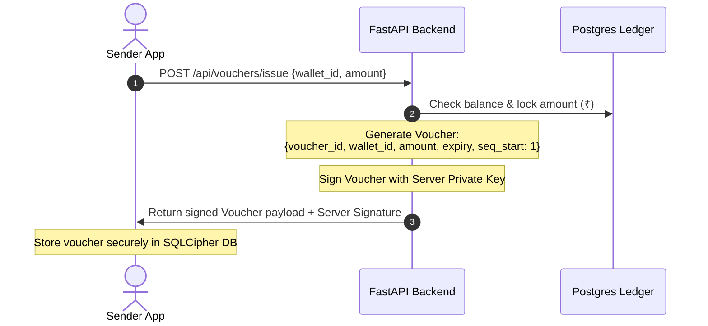
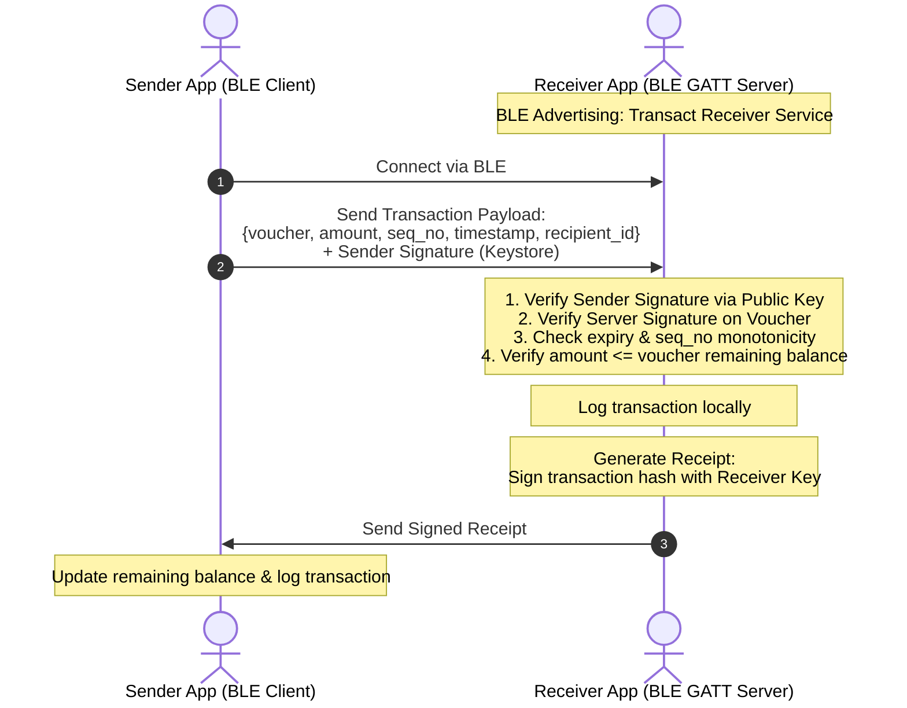
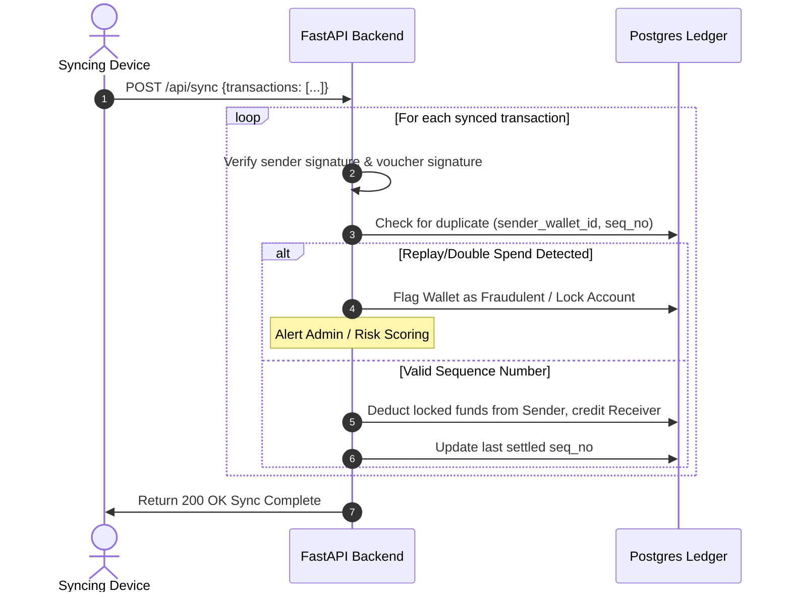

# Transact: Offline UPI Payment System Design Document

This design document outlines the technical architecture, security threat model, and regulatory compliance mapping for **Transact**, a secure offline peer-to-peer payment protocol with cryptographic double-spend protection.

---

## 1. Threat Model & Security Architecture

In an offline payment system, the core challenge is the lack of a real-time central clearinghouse. The system must defend against fraud using local cryptography, sequence numbers, and strict transaction limits.

### 1.1 Threat Matrix & Mitigations

| Threat | Description | Mitigation Strategy |
| :--- | :--- | :--- |
| **Double-Spending (Sender)** | A sender attempts to pay two different receivers offline using the same wallet balance (i.e. repeating sequence numbers). | 1. The device private key is isolated in the **Android Keystore** (TEE/StrongBox) to prevent key cloning. 2. Local storage uses **SQLCipher** to prevent database tampering. 3. Monotonic **Sequence Numbers** are signed inside each transaction. The backend detects replays during online sync and flags the malicious device. |
| **Transaction Replay (Receiver)** | A receiver tries to submit the same signed transaction payload multiple times to the backend to get paid twice. | The backend maintains a unique index on `(sender_wallet_id, sequence_number)` on the transaction ledger, rejecting any duplicate transaction submissions. |
| **State Rollback (Sender)** | A sender root/hacks their phone, backs up the database, performs a transaction, and restores the database to restore the balance. | Each transaction is signed with a monotonic sequence number linked to a specific signed **Voucher ID**. A gap or duplication in sequence numbers submitted at sync time immediately flags a mismatch and locks the wallet. |
| **Interception / Eavesdropping** | An attacker listens on BLE advertisements and intercepts the transaction data. | All transaction payloads are cryptographically signed by the sender, and the receiving handset validates this signature. BLE transmission can optionally include a transient session key derived via ECDH. |

---

## 2. Regulatory Alignment (RBI & UPI Lite)

Transact aligns its system limits with the **Reserve Bank of India (RBI)** framework for offline digital payments and NPCI's **UPI Lite** guidelines:

1. **Transaction Cap:** Max ₹1,000 per offline transaction (aligns with the offline transaction limits).
2. **Cumulative Wallet Cap:** Max ₹5,000 total balance allowed in the offline wallet at any time.
3. **Top-Up Channel:** Top-up is strictly **online** with two-factor authentication (AFA) from the user's linked bank account.
4. **Reconciliation:** All offline transactions are queued locally and automatically pushed to the settlement engine when connectivity is restored.

---

## 3. Cryptographic Transaction Flow

The system operates in three distinct phases: **Voucher Issuance (Online)**, **P2P Transfer (Offline BLE)**, and **Reconciliation (Online)**.

### 3.1 Voucher Issuance (Online Top-up)
Before making offline payments, the sender must obtain a signed voucher from the backend. The backend locks the corresponding funds in the user's online bank account.

### 3.2 Peer-to-Peer Payment (Offline BLE)
The sender transfers a portion of the voucher to the receiver via Bluetooth Low Energy (BLE).

### 3.3 Reconciliation & Sync (Online)
When either device gets internet access, it uploads its signed offline outbox/inbox logs.

---

## 4. Scope Cuts

To maintain a feasible timeline, the following elements are intentionally out-of-scope:
- **Real Bank Integration:** We simulate the banking core ledger on our FastAPI backend.
- **Hardware Token (StrongBox):** If the physical test device does not support StrongBox hardware keystores, we fallback to standard Android TEE (Trusted Execution Environment) Keystore storage.
- **Interactive Settlement Arbitration:** Dispute resolution for offline transactions is simplified; the backend has absolute authority during reconciliation.
